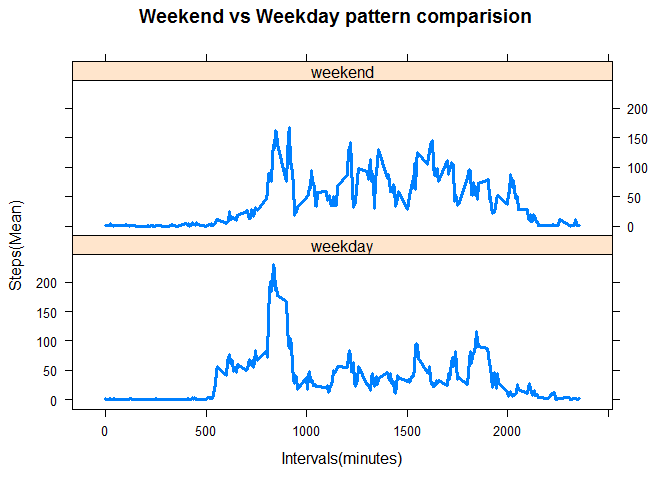

# Reproducible Research: Peer Assessment 1
M Askari  
Saturday, May 16, 2015  


This is an R Markdown document for peer assignment 1 of coursera course.  

### Data for this assignment

Dataset: [Activity monitoring data](https://d396qusza40orc.cloudfront.net/repdata%2Fdata%2Factivity.zip)

### Variables in input data

- steps: Number of steps taking in a 5-minute interval (missing values are coded as NA)

- date: The date on which the measurement was taken in YYYY-MM-DD format

- interval: Identifier for the 5-minute interval in which measurement was taken

### Setting Working Directory


```r
# Please set the working directory to location you saved input data
# Commented for final commit. 
# setwd("C:/XXXXXX/GitHub/RepData_PeerAssessment1")
```


## Loading and preprocessing the data

  
   
   
## What is mean total number of steps taken per day?

Below chart shows a historgam for number of steps taken for each day. 
 

### Daily Mean

Below chart shows daily mean of steps taken (excluding NA days):

 


### Daily Median

Below chart shows daily Median of steps taken (excluding NA days):

 

Values of summary is presentd in variable named `dailySummary` . Here is how you can access this variable using head command:


```
## Source: local data frame [10 x 3]
## 
##          date Daily_Mean Daily_Median
## 1  2012-10-01        NaN           NA
## 2  2012-10-02    0.43750            0
## 3  2012-10-03   39.41667            0
## 4  2012-10-04   42.06944            0
## 5  2012-10-05   46.15972            0
## 6  2012-10-06   53.54167            0
## 7  2012-10-07   38.24653            0
## 8  2012-10-08        NaN           NA
## 9  2012-10-09   44.48264            0
## 10 2012-10-10   34.37500            0
```


## What is the average daily activity pattern?


 

Arranging the variable `dailyPattern` by column of dailyMean and selecting the first row will give you answer to which interval has Maximum avg number of steps:


```
## Source: local data frame [1 x 2]
## 
##   intervals dailyMean
## 1       835  206.1698
```

Converting above value to time in a day. Makes 1:55 PM to 2:00 PM holding record of number of steps in our dataset.

## Imputing missing values 


In our data set we have following number as rows without value in "steps" column


```
## [1] 2304
```

 
And now we are showing the daily Mean and Median after chaning the missing values

### Daily Mean ( With NA data replaced)

 

### Daily Median ( With NA data replaced)

 

### Impact of replacing NA

As you can see and compare two histograms the filling up missing values DID NOT change the sample mean. Histogram is more peaked around the mean.


## Are there differences in activity patterns between weekdays and weekends?


  


